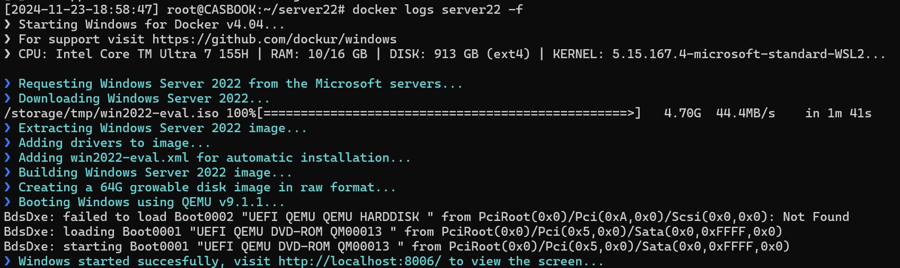

## swc_windows

* This repository contains a script to deploy containerized Windows Operating Systems via docker containers and KVM. For any additional details or inquiries, please contact me at christopher.sargent@sargentwalker.io.
* Tested on Ubuntu 22.04 VM
* [Dockur Windows](https://github.com/dockur/windows/tree/master)

### Docker install for Ubuntu 
1. ssh user@IP
2. sudo -i 
3. curl -fsSL https://get.docker.com -o install-docker.sh && sudo sh install-docker.sh

### Deploy Windows Sever 2022
1. ssh user@IP
2. sudo -i 
3. git clone 
4. cd swc_windows
5. vim .env
* Update password
```
# Set your container details
VERSION=2022
RAM_SIZE=8G
USERNAME=CAS
PASSWORD=31nst31n
DISK_SIZE=64
CPU_CORES=4
```
  Select The Windows OS Version from the values below:
  
  | **Value** | **Version**           | **Size** |
  |---|---|---|
  | `11`   | Windows 11 Pro           | 5.4 GB   |
  | `11l`  | Windows 11 LTSC          | 4.2 GB   |
  | `11e`  | Windows 11 Enterprise    | 5.8 GB   |
  ||||
  | `10`   | Windows 10 Pro           | 5.7 GB   |
  | `10l`  | Windows 10 LTSC          | 4.6 GB   |
  | `10e`  | Windows 10 Enterprise    | 5.2 GB   |
  ||||
  | `8e`   | Windows 8.1 Enterprise   | 3.7 GB   |
  | `7e`   | Windows 7 Enterprise     | 3.0 GB   |
  | `ve`   | Windows Vista Enterprise | 3.0 GB   |
  | `xp`   | Windows XP Professional  | 0.6 GB   |
  ||||
  | `2025` | Windows Server 2025      | 5.0 GB   |
  | `2022` | Windows Server 2022      | 4.7 GB   |
  | `2019` | Windows Server 2019      | 5.3 GB   |
  | `2016` | Windows Server 2016      | 6.5 GB   |
  | `2012` | Windows Server 2012      | 4.3 GB   |
  | `2008` | Windows Server 2008      | 3.0 GB   |
  | `2003` | Windows Server 2003      | 0.6 GB   |

6. ./windows_deploy.sh
* Verify .sh scripts are executable chmod +x *.sh
7. docker ps 
```
CONTAINER ID   IMAGE             COMMAND                  CREATED             STATUS             PORTS                                                                                                                               NAMES
badb0a8c2e27   dockurr/windows   "/usr/bin/tini -s /r…"   18 minutes ago      Up 18 minutes      0.0.0.0:3389->3389/tcp, 0.0.0.0:3389->3389/udp, :::3389->3389/tcp, :::3389->3389/udp, 0.0.0.0:8007->8006/tcp, [::]:8007->8006/tcp   swc-windows
```
8. docker logs -f swc-windows



9. http://localhost:8007/


